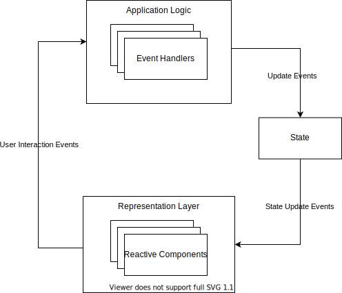

# Turbo Core

A web UI framework based on native custom web components. 

The custom elements in this library are defined using [lit-element](https://lit-element.polymer-project.org/).

## Philosophy

The aim of this project is to create a lightweight and fast framework for developing web applications.
By using web's native standard's and [web components](https://developer.mozilla.org/en-US/docs/Web/Web_Components)
in particular we can **make development easier and faster** and also **increase performance**.
The web components standard is now implemented in the [latest versions of most major browsers](https://caniuse.com/#feat=custom-elementsv1). 

Web components can be reused regardless of the javascript stack that you are currently using, since they don't rely on extra packages to be bundled with the application, your application to be structured in a particular way or built using certain build tools. Hence using web components **increases interoperability and code reuse between different projects**.

By developing custom HTML elements we can create a declarative way of defining user interfaces that is easy to be written or modified, not only by developers but also by anyone who understands the basics of html. Turbo aims to keep the application logic (Javascript/Typescript/Or even other languages) separate from the representation layer (Html). This has a few advantages over mixing the two (as is done in [React](https://reactjs.org/)). A separate application logic does not interact with browser's [dom](https://developer.mozilla.org/en-US/docs/Web/API/Document_Object_Model) or other APIs, which means it can be **much easier tested**, can be **written in languages other than javascript**, can be **run in a different thread using web workers to increase performance** and is **easier to maintain** as it reduces scope to only handling the application's logic.

An isolated representation layer can be generated by machine or written by hand, which means it can be possibly a format that is produced by a [user interface builder](https://en.wikipedia.org/wiki/Graphical_user_interface_builder). Code that handles the dom and renders data to be viewed and interacted by the user is written as web components. The components are customized to fit the use cases of the application by setting their attributes and applying css. This would encourage creating reusable components, which can be applied in different context and applications inside of being tied to a certain framework or application.



Similar to a [redux application](https://redux.js.org/basics/data-flow#data-flow), Turbo's data flow is unidirectional. This ensures that there are no surprises when it comes to where data is coming from, and their is single source of what is represented by the UI components, which is the state.


## Development

1. Install dependencies:
```
yarn
```

3. Build the library
```
yarn build --watch
```
Builds the library and watches for any changes, outputs into `public/dist`.


2. Serve public folder:
```
yarn start
```
This will serve the contents of `public` on http://localhost:9080 to test the library.
